### Procedure

1.  Click on the simulation button and this page will be displayed. Hover over the description button to get a brief explanation about the experiment.

    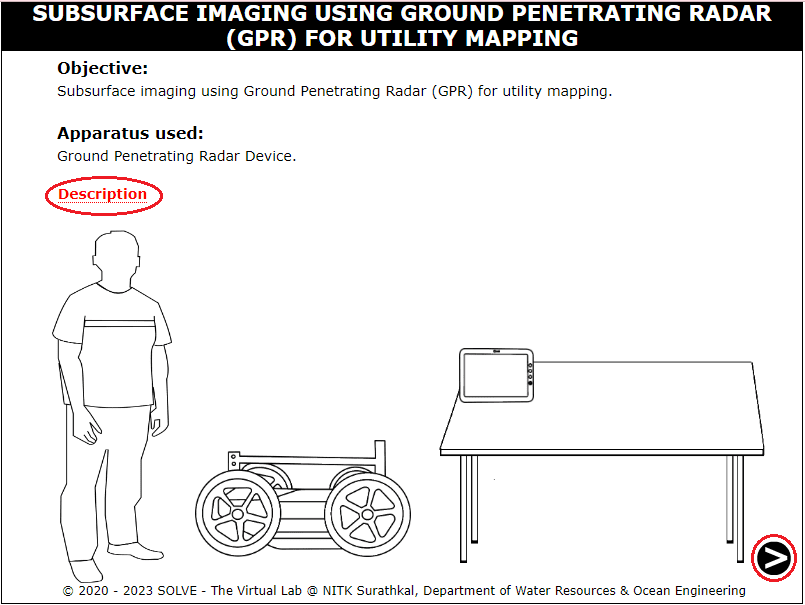

2.  Click on the power button to start the GPR device and then click on the next button.

    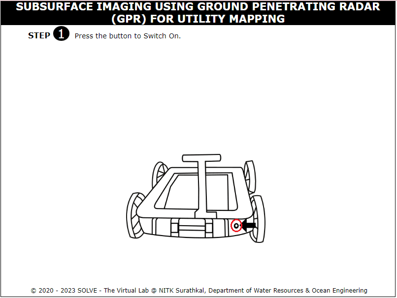

3. Click on the holding arm to open the device and click on the tablet holder to place the tablet. Click on the next button to move forward in the simulation.

   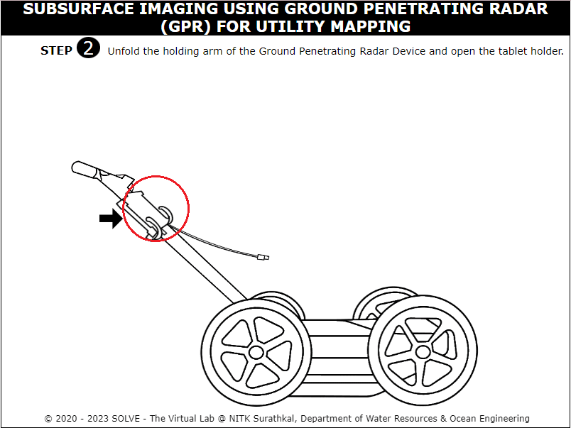

   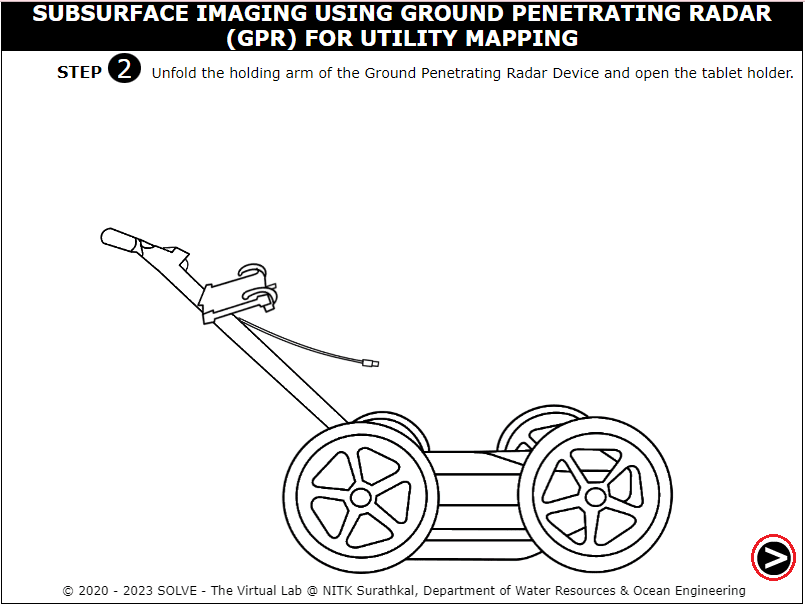

4. Fix the tablet on to the tablet holder and attach the cable to the tablet.

   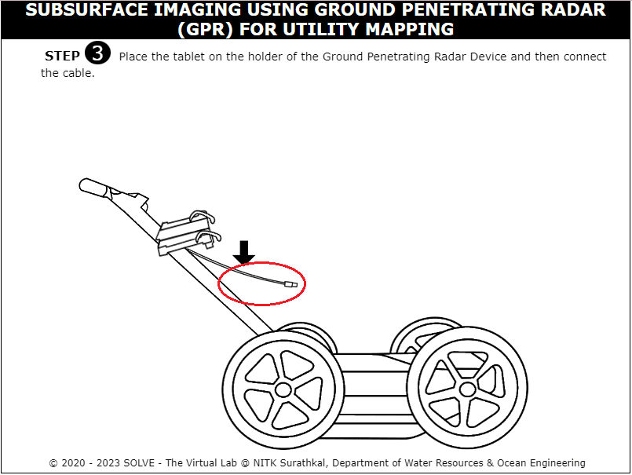

   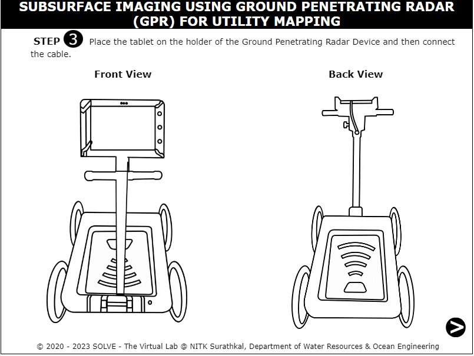

5. Click on the power button to start the tablet and do all the initial settings for data capturing.

    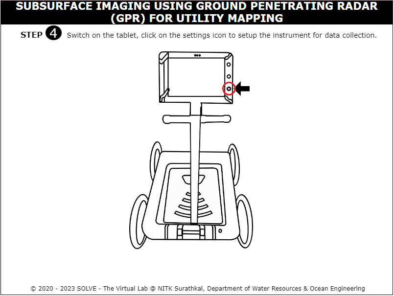

    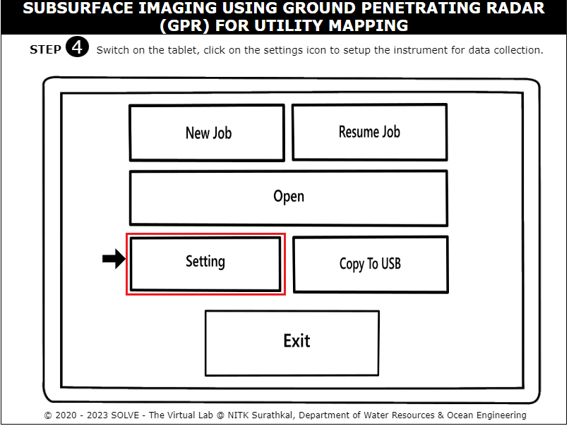
   
    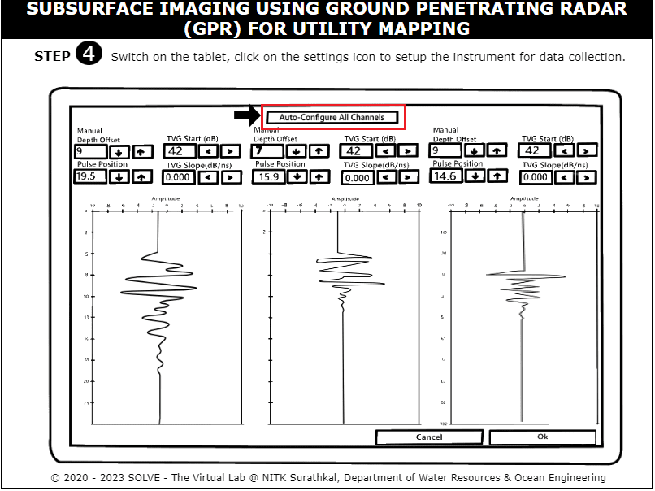

    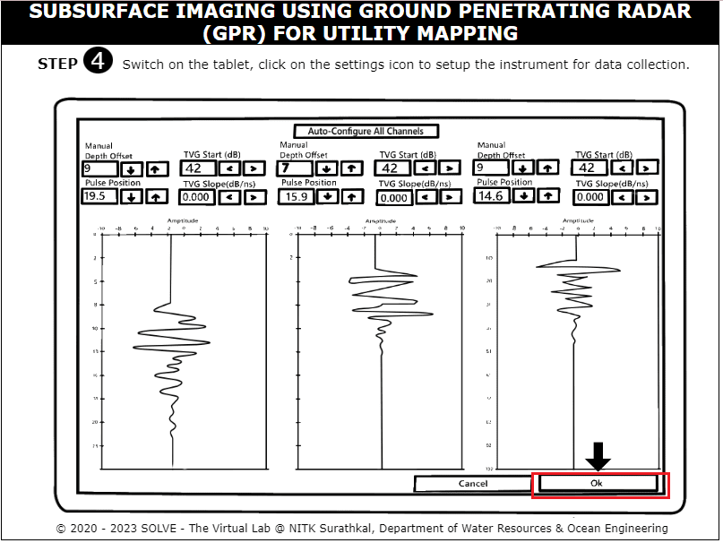

6. Click on the new job icon to start a new set of data collection and click on ok.

    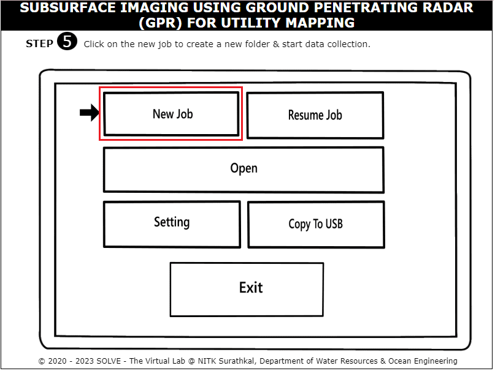

    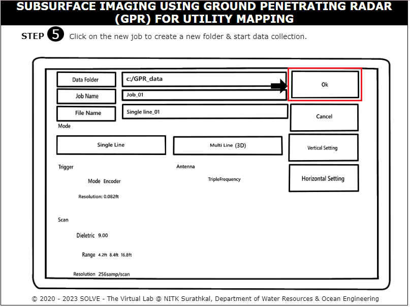
   
7. Click on the play button on the screen and start moving the GPR device to log the data.

    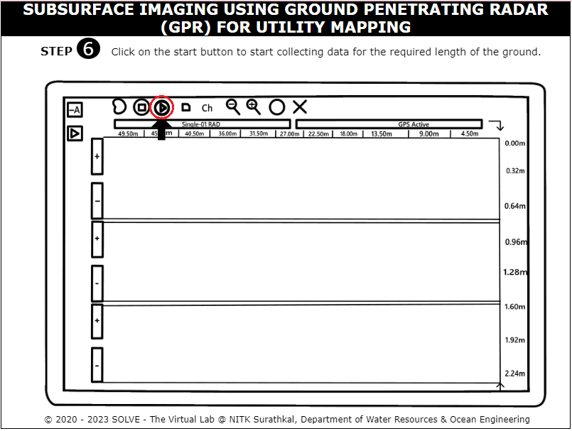

    
  

8. Click on the convex shaped structures which symbolizes the utilities that are present under the particular stretch. Note down the horizontal and vertical distances from the ground surface.

    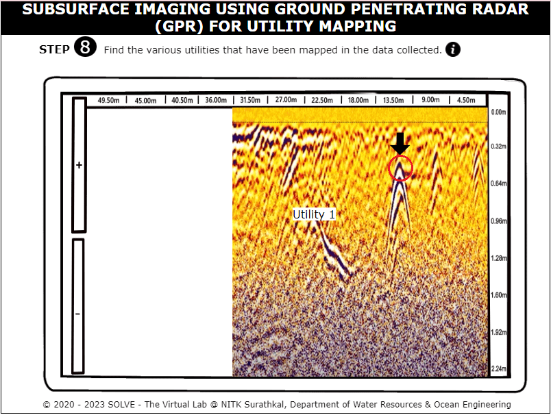

    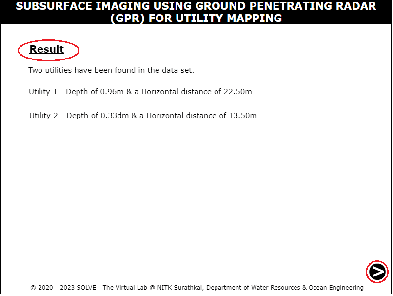

  
9. Similarly carry out the same procedure to carry out data collection at site 2. Click on the save button to save the data collected for this particular stretch.

    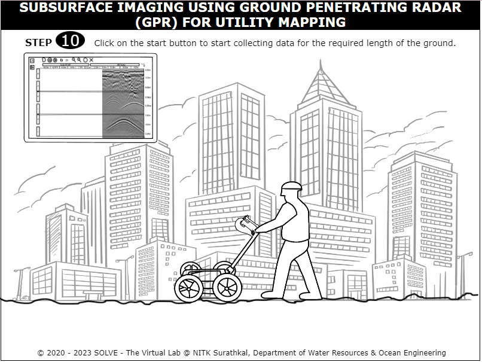

    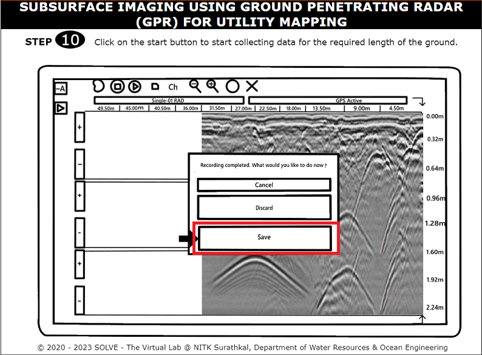
  

10. Click on the utilities and mark their respective positions from the ground.

    

    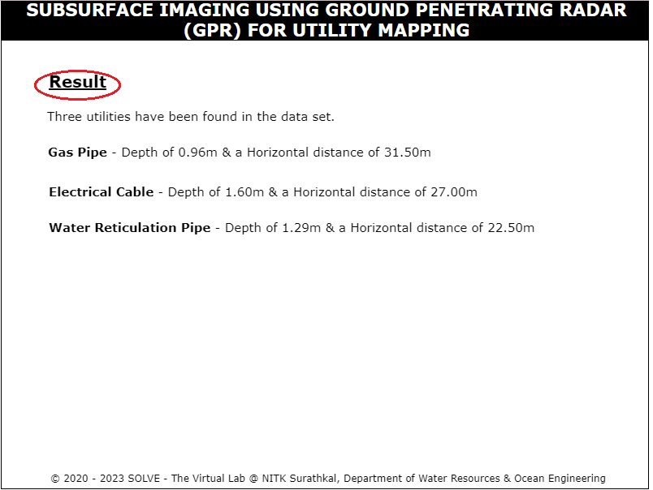
    

